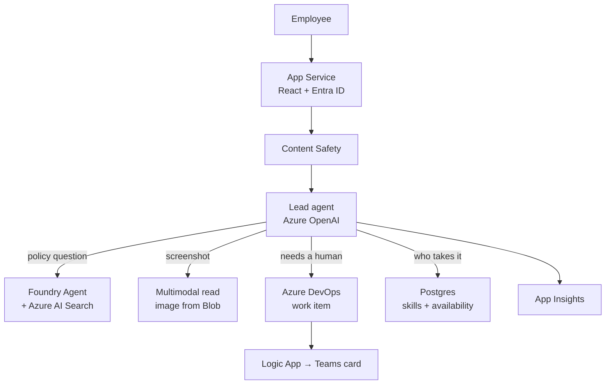
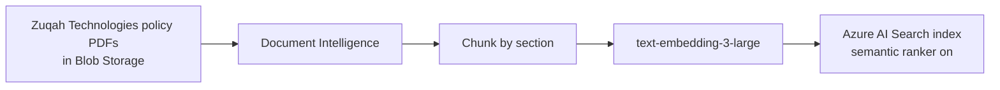

# Architecture

## One paragraph

A React application, served from Azure App Service, authenticates employees with
Entra ID and streams a chat conversation. A lead agent running on Azure OpenAI
decides, per turn, whether to answer from the knowledge base, read an attached
screenshot, file a ticket, or work out who should take it. Knowledge answers come
from an **Azure AI Foundry Agent** with an **Azure AI Search** tool — a real agent,
visible in the Foundry portal — whose stream is merged into the same conversation.
Tickets are real work items in Azure DevOps. Assignment reads skills and
availability from Postgres. Everything is traced to Application Insights.

## System



## Azure services, by stage

| Stage | Services | Doing what |
| --- | --- | --- |
| Self-help | AI Search, Azure OpenAI, Document Intelligence, Blob | Index and answer from policy documents with citations |
| Issue diagnosis | Azure OpenAI (multimodal), Blob, Content Safety | Read the screenshot, quote the error, rule causes out |
| Problem resolution | Azure DevOps, Logic Apps | File the work item, notify Teams |
| Support assignment | Postgres, Entra ID | Match skills to availability, resolve identity |
| Continuous improvement | Application Insights, Log Analytics | Deflection rate, top questions, knowledge gaps |

Cross-cutting: **Key Vault** for secrets, **Container Registry** for the image,
**Bicep** for the whole environment.

### One resource delivers four of these

The chat model, embeddings, the Foundry Agent runtime, Content Safety and
Document Intelligence all come from a **single AI Foundry account**
(`kind: 'AIServices'`) rather than four separate resources. Same services, same
work, one thing to provision. See [ADR-0008](decisions/0008-single-foundry-account.md).

## Why a Foundry Agent for knowledge, and app-side orchestration for the rest

The knowledge agent is a genuine Foundry Agent so it can be opened in the Azure AI
Foundry portal during the demo — its instructions, its Azure AI Search tool, its
threads. That is a materially stronger claim than "our app calls Azure OpenAI."

The remaining tools stay in the application because they need request-scoped
identity, custom result rendering, and the streaming behaviour the UI depends on.
Full reasoning in [ADR-0002](decisions/0002-foundry-agent-for-knowledge.md).

## Knowledge pipeline



Source documents are generated as PDF and DOCX rather than markdown so
Document Intelligence has a real job rather than a decorative one.

## Identity and authorisation

- **Authentication** — Entra ID OAuth2, session in a signed HTTP-only cookie.
- **Who is allowed in** — Entra Enterprise Application with *assignment required*,
  governed by a security group. The application maintains no access list.
- **Record scoping** — tools that read user records resolve the caller
  server-side from the session. The model is never given an identity parameter
  and cannot supply one. See [ADR-0006](decisions/0006-identity-never-in-tool-schema.md).

## Environments

One environment: `dev`. Everything lives in `rg-zuqah-cs-dev`, deployed at
subscription scope by a single Bicep template that also creates the resource group,
so teardown is one command. 26 resources, all in `eastus2`.

No shared resources. Nothing in this project reads or writes anything belonging to
another team, with one exception: the container registry `zuqah-acr`, referenced
read-only via admin credentials, because provisioning a second registry buys
nothing. See [ADR-0001](decisions/0001-separate-project.md).

## Repository layout

```
nri-service-agent/
├── docs/                  charter, architecture, phases, decisions
├── infra/                 Bicep — main.bicep + modules/
├── data/                  fabricated Zuqah Technologies source content
├── app/                   the web application
│   ├── agent/             prompts, tools, orchestration
│   ├── knowledge/         ingestion pipeline and search client
│   ├── tickets/           Azure DevOps integration
│   ├── assignment/        skills and availability
│   ├── chat/              streaming API and UI
│   └── auth/              Entra sign-in and session
└── scripts/               ingestion, seeding, demo reset
```

## What we deliberately did not do

- **pgvector instead of AI Search** — rejected; see [ADR-0003](decisions/0003-ai-search-over-pgvector.md)
- **Extending the existing nri-spark app** — rejected; see [ADR-0001](decisions/0001-separate-project.md)
- **In-app role tables for access control** — rejected; see [ADR-0004](decisions/0004-entra-group-access.md)
